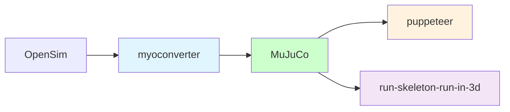

# 人类运动

人类运动的建模包括身体几何形状（骨骼），身体物理（肌肉），身体环境相互作用（触觉）；模仿学习（视频到控制；与RL步行和跑步），视觉指导的步行（视觉导航；虚幻引擎）。




## 配置
```shell
# 创建虚拟Python环境
conda create -n locomotion -c conda-forge python=3.10 pip ipython cudatoolkit=11.8.0
# 激活虚拟环境
conda activate locomotion
# 安装依赖
pip install -r requirements.txt
# deactivate virtual environment
# conda deactivate locomotion
# remove virtual environment
# conda remove -n locomotion --all
```

## 开始 flybody

果蝇身体模型位于 [这个目录][fly-home] 中。为了使其可视化，您可以拖放 fruitfly.xml`或`floes.xml` 到 [MuJoCo]（https://github.com/google-deepmind/mujoco/releases）的`simulate` 查看器。

通过 [fly.demo.py](fly_demo.py) 与果蝇进行交互。

开始使用 `flybody` 的最快方法是看 [教程](docs) 。

另外，[果蝇环境示例的脚本](docs/fly_env_example.py) 显示了飞行、步行和视觉引导的飞行强化学习任务环境的示例。

To train the fly, try the [distributed RL training script][ray-script], which uses [Ray][ray] to parallelize the [DMPO][dmpo] agent training.

[fly-home]: https://github.com/OpenHUTB/locomotion/tree/master/flybody/fruitfly/assets
[drosophila_wikipedia]: https://en.wikipedia.org/wiki/Drosophila_melanogaster
[mujoco]: https://github.com/google-deepmind/mujoco
[tutorial]: https://github.com/OpenHUTB/locomotion/blob/master/docs/getting-started.ipynb
[tutorial-colab]: https://colab.research.google.com/github/OpenHUTB/locomotion/blob/master/docs/getting-started.ipynb
[dmpo]: https://github.com/google-deepmind/acme/tree/master/acme/agents/tf/dmpo
[ray-script]: https://github.com/OpenHUTB/locomotion/blob/master/flybody/train_dmpo_ray.py
[paper]: https://www.nature.com/articles/s41586-025-09029-4
[preprint]: https://www.biorxiv.org/content/10.1101/2024.03.11.584515v2
[ray]: https://github.com/ray-project/ray
[tf]: https://github.com/tensorflow/tensorflow
[acme]: https://github.com/google-deepmind/acme
[mujoco-rendering]: https://github.com/google-deepmind/dm_control/tree/main?tab=readme-ov-file#rendering


## Installation

Follow these steps to install `flybody`:

1. Clone this repo and create a new conda environment:
   ```bash
   git clone https://github.com/OpenHUTB/locomotion.git
   cd flybody
   conda create --name locomotion -c conda-forge python=3.10 pip ipython cudatoolkit=11.8.0
   conda activate locomotion
   ```
   `flybody` can be installed in one of the three modes described next. Also, for installation in editable (developer) mode, use the commands as shown. For installation in regular, not editable, mode, drop the `-e` flag.
   
2. **Core installation**: minimal installation for experimenting with the fly model in MuJoCo or prototyping task environments. ML dependencies such as [Tensorflow][tf] and [Acme][acme] are not included and policy rollouts and training are not automatically supported.
   ```bash
   pip install -e .
   ```
   
3. **ML extension (optional)**: same as core installation, plus ML dependencies (Tensorflow, Acme) to allow running policy networks, e.g. for inference or for training using third-party agents not included in this library.
   ```bash
   pip install -e .[tf]
   ```

4. **Ray training extension (optional)**: same as core installation and ML extension, plus [Ray][ray] to also enable
   distributed policy training in the fly task environments.
   ```bash
   pip install -e .[ray]
   ```


### Additional configuring

1. You may need to set [MuJoCo rendering][mujoco-rendering] environment varibles, e.g.:
   ```bash
   export MUJOCO_GL=egl
   export MUJOCO_EGL_DEVICE_ID=0
   ```
2. Also, for the ML and Ray extensions, `LD_LIBRARY_PATH` may require an update, e.g.:
   ```bash
   CUDNN_PATH=$(dirname $(python -c "import nvidia.cudnn;print(nvidia.cudnn.__file__)"))
   export LD_LIBRARY_PATH=$LD_LIBRARY_PATH:$CONDA_PREFIX/lib/:$CUDNN_PATH/lib
   ```

3. You may want to run `pytest` to test the main components of the `flybody` installation.


## Run Pedestrian
Launch CarlaUE4.exe and run these script:
```shell
python Carla_Pedestrian_PPO.py
```

Run with GUI:
```shell
python Carla_Pedestrian_System_GUI.py
```
Select `Initialize Environment`, make sure the start and end points are in the csv, then click `Start Training`.


## Reference

* [flybody](https://github.com/TuragaLab/flybody) - [flybody dataset](https://doi.org/10.25378/janelia.25309105)
* [puppeteer](https://github.com/nicklashansen/puppeteer) - Using MDControl in MuJoCo: Layered World Model as a Visual Full-Body Humanoid Controller
* [MuJoCo musculoskeletal models set](https://github.com/MyoHub/myosuite)
* [myoconverter](https://github.com/MyoHub/myoconverter)


