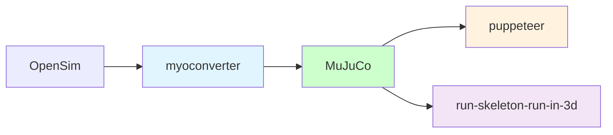

# Human Locomotion

`human-body`: human body model for MuJoCo physics.




## Configuration
```shell
# create virtual python environment
conda create -n locomotion -c conda-forge python=3.10 pip ipython cudatoolkit=11.8.0
# activate virtual environment
conda activate locomotion
# install dependence
pip install -r requirements.txt
# deactivate virtual environment
# conda deactivate locomotion
# remove virtual environment
# conda remove -n locomotion --all
```

## Start flybody

The fruit fly body model lives in [this directory][fly-home]. To visualize it, you can drag-and-drop `fruitfly.xml` or `floor.xml` to [MuJoCo](https://github.com/google-deepmind/mujoco/releases)'s `simulate` viewer.

Interacting with the fly via Python is as simple as:

```python
import numpy as np
import mediapy

from flybody.fly_envs import walk_imitation

# Create walking imitation environment.
env = walk_imitation()

# Run environment loop with random actions for a bit.
for _ in range(100):
   action = np.random.normal(size=59)  # 59 is the walking action dimension.
   timestep = env.step(action)

# Generate a pretty image.
pixels = env.physics.render(camera_id=1)
mediapy.show_image(pixels)
```

The quickest way to get started with `flybody` is to take a look at a [tutorial notebook][tutorial] or [][tutorial-colab].

Also, [this notebook][envs] shows examples of the flight, walking, and vision-guided flight RL task environments. 

To train the fly, try the [distributed RL training script][ray-script], which uses [Ray][ray] to parallelize the [DMPO][dmpo] agent training.

[fly-home]: https://github.com/OpenHUTB/locomotion/tree/master/flybody/fruitfly/assets
[drosophila_wikipedia]: https://en.wikipedia.org/wiki/Drosophila_melanogaster
[mujoco]: https://github.com/google-deepmind/mujoco
[tutorial]: https://github.com/OpenHUTB/locomotion/blob/master/docs/getting-started.ipynb
[tutorial-colab]: https://colab.research.google.com/github/OpenHUTB/locomotion/blob/master/docs/getting-started.ipynb
[dmpo]: https://github.com/google-deepmind/acme/tree/master/acme/agents/tf/dmpo
[envs]: https://github.com/OpenHUTB/locomotion/blob/master/docs/fly-env-examples.ipynb
[ray-script]: https://github.com/OpenHUTB/locomotion/blob/master/flybody/train_dmpo_ray.py
[paper]: https://www.nature.com/articles/s41586-025-09029-4
[preprint]: https://www.biorxiv.org/content/10.1101/2024.03.11.584515v2
[ray]: https://github.com/ray-project/ray
[tf]: https://github.com/tensorflow/tensorflow
[acme]: https://github.com/google-deepmind/acme
[mujoco-rendering]: https://github.com/google-deepmind/dm_control/tree/main?tab=readme-ov-file#rendering


## Installation

Follow these steps to install `flybody`:

1. Clone this repo and create a new conda environment:
   ```bash
   git clone https://github.com/OpenHUTB/locomotion.git
   cd flybody
   conda create --name locomotion -c conda-forge python=3.10 pip ipython cudatoolkit=11.8.0
   conda activate locomotion
   ```
   `flybody` can be installed in one of the three modes described next. Also, for installation in editable (developer) mode, use the commands as shown. For installation in regular, not editable, mode, drop the `-e` flag.
   
2. **Core installation**: minimal installation for experimenting with the fly model in MuJoCo or prototyping task environments. ML dependencies such as [Tensorflow][tf] and [Acme][acme] are not included and policy rollouts and training are not automatically supported.
   ```bash
   pip install -e .
   ```
   
3. **ML extension (optional)**: same as core installation, plus ML dependencies (Tensorflow, Acme) to allow running policy networks, e.g. for inference or for training using third-party agents not included in this library.
   ```bash
   pip install -e .[tf]
   ```

4. **Ray training extension (optional)**: same as core installation and ML extension, plus [Ray][ray] to also enable
   distributed policy training in the fly task environments.
   ```bash
   pip install -e .[ray]
   ```


### Additional configuring

1. You may need to set [MuJoCo rendering][mujoco-rendering] environment varibles, e.g.:
   ```bash
   export MUJOCO_GL=egl
   export MUJOCO_EGL_DEVICE_ID=0
   ```
2. Also, for the ML and Ray extensions, `LD_LIBRARY_PATH` may require an update, e.g.:
   ```bash
   CUDNN_PATH=$(dirname $(python -c "import nvidia.cudnn;print(nvidia.cudnn.__file__)"))
   export LD_LIBRARY_PATH=$LD_LIBRARY_PATH:$CONDA_PREFIX/lib/:$CUDNN_PATH/lib
   ```

3. You may want to run `pytest` to test the main components of the `flybody` installation.


## Run Pedestrian
Launch CarlaUE4.exe and run these script:
```shell
python Carla_Pedestrian_PPO.py
```

Run with GUI:
```shell
python Carla_Pedestrian_System_GUI.py
```
Select `Initialize Environment`, make sure the start and end points are in the csv, then click `Start Training`.


## Reference

* [Undergraduate thesis](https://github.com/OpenHUTB/sim/tree/master/pedestrian)
* [flybody](https://github.com/TuragaLab/flybody)
* [Existing locomotion task library based on MuJoCo](https://github.com/google-deepmind/dm_control/tree/main/dm_control/locomotion)


