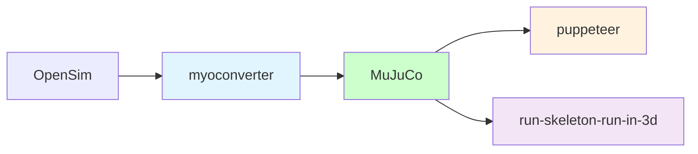

# 人的运动

人的运动建模包括身体几何形状（骨骼），身体物理（肌肉），身体环境相互作用（触觉）；模仿学习（视频到控制；与RL步行和跑步），视觉指导的步行（视觉导航；虚幻引擎）。




## 配置
```shell
# 创建虚拟Python环境
conda create -n locomotion -c conda-forge python=3.10 pip ipython cudatoolkit=11.8.0
# 激活虚拟环境
conda activate locomotion
# 安装依赖
pip install -r requirements.txt
# deactivate virtual environment
# conda deactivate locomotion
# remove virtual environment
# conda remove -n locomotion --all
```

## 开始 flybody

果蝇身体模型位于 [资产目录](https://github.com/OpenHUTB/locomotion/tree/master/flybody/fruitfly/assets) 中。为了使其可视化，您可以拖放 `fruitfly.xml`或 `floes.xml` 到 [MuJoCo](https://github.com/google-deepmind/mujoco/releases) 的`simulate` 查看器。

通过 [fly.demo.py](fly_demo.py) 与果蝇进行交互。

开始使用 `flybody` 的最快方法是看 [教程](docs) 。

另外，[果蝇环境示例的脚本](docs/fly_env_example.py) 显示了飞行、步行和视觉引导的飞行强化学习任务环境的示例。

要训练果蝇，请尝试 [分布式RL训练脚本](https://github.com/OpenHUTB/locomotion/blob/master/flybody/train_dmpo_ray.py) ，它使用 [Ray](https://github.com/ray-project/ray) 并行化 [DMPO](https://github.com/google-deepmind/acme/tree/master/acme/agents/tf/dmpo) 代理训练。


## 安装

请按照以下步骤安装`flybody`：

1. 从远程仓库安装：
   ```bash
   pip install git+https://github.com/TuragaLab/flybody.git
   pip install "flybody[tf] @ git+https://github.com/TuragaLab/flybody.git"
   pip install "flybody[ray] @ git+https://github.com/TuragaLab/flybody.git"
   ```

注意：dm-reverb只支持Linux。

2. 执行测试
```shell
ruff check flybody/
pytest tests/
pytest tests/test-tf.py
```


## Hutb 中行人的运行
启动carlaue4.exe并运行以下脚本：
```shell
python Carla_Pedestrian_PPO.py
```

带 图像界面的运行：
```shell
python Carla_Pedestrian_System_GUI.py
```
选择“初始化环境”，请确保起点和终点位于CSV中，然后单击“开始训练”。


## 参考

* [flybody](https://github.com/TuragaLab/flybody) - [flybody dataset](https://doi.org/10.25378/janelia.25309105)
* [puppeteer](https://github.com/nicklashansen/puppeteer) - Using MDControl in MuJoCo: Layered World Model as a Visual Full-Body Humanoid Controller
* [MuJoCo musculoskeletal models set](https://github.com/MyoHub/myosuite)
* [myoconverter](https://github.com/MyoHub/myoconverter)


