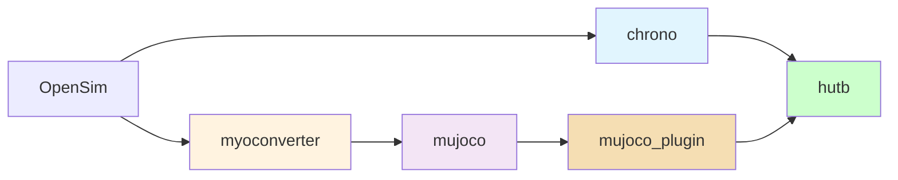

# 人的运动

人的运动包括身体几何形状（骨骼），身体物理（肌肉），身体环境相互作用（触觉）**建模**；模仿**学习**（视频到控制；与RL步行和跑步），视觉指导的步行（视觉导航；虚幻引擎）。


```mermaid
graph LR
    A[OpenSim] --> B[chrono]
    B --> C[hutb]
    A --> D[myoconverter]
    D --> E[mujoco]
    E --> F[mujoco_plugin]
    F --> C
    
    style B fill:#e1f5fe
    style C fill:#ccffcc
    style D fill:#fff3e0
    style E fill:#f3e5f5
    style F fill:#F5DEB3
```

具体实现请参考： [文档](https://openhutb.github.io/locomotion/) 、[人的移动](https://github.com/OpenHUTB/locomotion/tree/master/human) 。
实现流程参考 [果蝇的飞行](./flybody/README.md)。

## hutb 实现的人运行
启动  Carlaue4.exe 并运行以下脚本：
```shell
python src/Carla_Pedestrian_PPO.py
```

带图像界面的运行：
```shell
python src/Carla_Pedestrian_System_GUI.py
```
选择“初始化环境”，请确保起点和终点位于CSV中，然后单击“开始训练”。


如果不知道上面在说什么，就回到页面最上头，点一下右边 About 下面的 [链接](https://openhutb.github.io/locomotion/) 进入教程吧


## 参考

* [flybody](https://github.com/TuragaLab/flybody) - [flybody dataset](https://doi.org/10.25378/janelia.25309105)
* [puppeteer](https://github.com/nicklashansen/puppeteer) - Using MDControl in MuJoCo: Layered World Model as a Visual Full-Body Humanoid Controller
* [基于模仿学习的人运动的全身控制](https://github.com/robfiras/loco-mujoco) - 包括 [SkeletonMuscle、MyoSkeleton](https://github.com/robfiras/loco-mujoco/tree/master/loco_mujoco/environments) ，支持动作捕捉器、无预训练模型
* [MuJoCo musculoskeletal models set](https://github.com/MyoHub/myosuite)
* [myoconverter](https://github.com/MyoHub/myoconverter)


