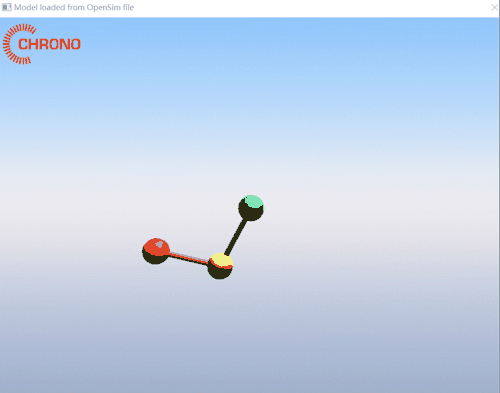
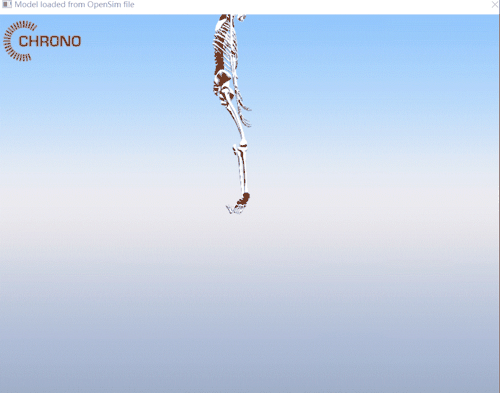

# 基于 Chrono 的肌肉骨骼解析和控制

预备知识：[行人物理场模式](https://openhutb.github.io/doc/pedestrian/tuto_content_chrono_opensim/) 、 [解析器的理论介绍](https://openhutb.github.io/doc/chrono/OpenSim_parser/) 、[源代码编译](https://openhutb.github.io/doc/chrono/build_in_windows/) 。


运行 [demo_PARSER_OpenSim.cpp](https://github.com/OpenHUTB/chrono/blob/hutb/src/demos/parsers/demo_PARSER_OpenSim.cpp) 后的效果：



## 运行指定 osim 文件

在 Visual Studio 2022 中输入参数并运行你的程序，可以按照以下步骤操作：

* 在 Visual Studio 解决方案资源管理器中右键单击项目`demo_PARSER_OpenSim`，然后选择“属性”。
* 在“属性”窗口中，选择“调试”选项卡。
* 在“命令参数”文本框中输入你想要传递给程序的参数，比如`-f  opensim/double_pendulum.osim`。
* 点击“确定”按钮保存更改，按Ctrl+F5继续运行。


目前支持的模型列表位于 [chrono/data/opensim](https://github.com/OpenHUTB/chrono/tree/hutb/data/opensim) ，有些模型运行需要添加额外参数：

```shell
# 添加 -c true 启用碰撞才会有牛顿摆对撞的效果
demo_PARSER_OpenSim.exe  -f  opensim/newton_cradle.osim  -c true
# 骨骼模型需要添加 -r true 启用渲染可视化网格才能有骨骼效果
demo_PARSER_OpenSim.exe  -f  opensim/Rajagopal2015.osim  -r true  -c true
```




## 增加地面

参考 demo_VEH_RigidTerrain_WheeledVehicle 中的刚体地形来测试人的站立。

刚体地面上的车子示例可以按`WASD`进行控制。

高机动性、多用途、轮式(非履带式)车辆，简称HMMWV(HighMobility Multi-purpose Wheeled Vehicle)，（简称悍马），外文名HMMWV或Humvee。


## 其他

车辆在使用土壤接触模型的可变性地面上拐弯运动 demo_VEH_SCMTerrain_WheeledVehicle。

* [已有示例列表](./demo_list.md)

