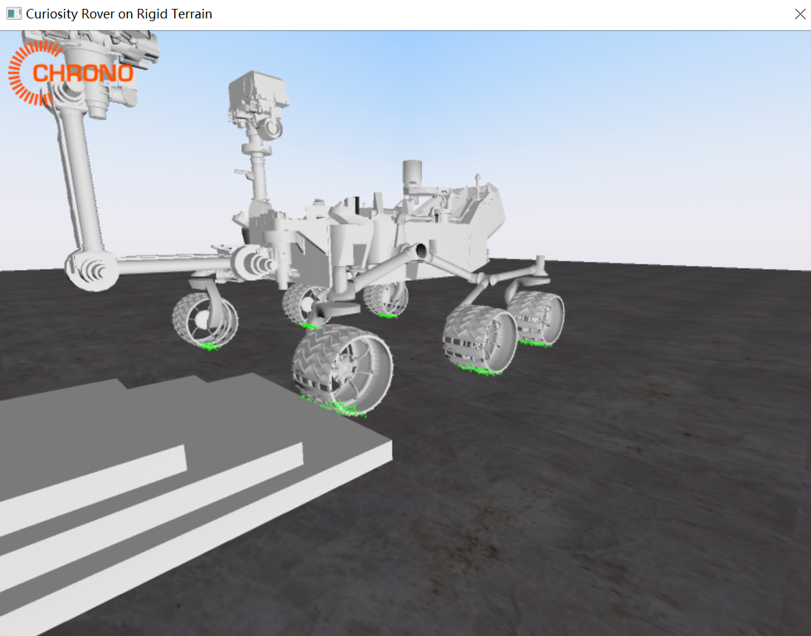
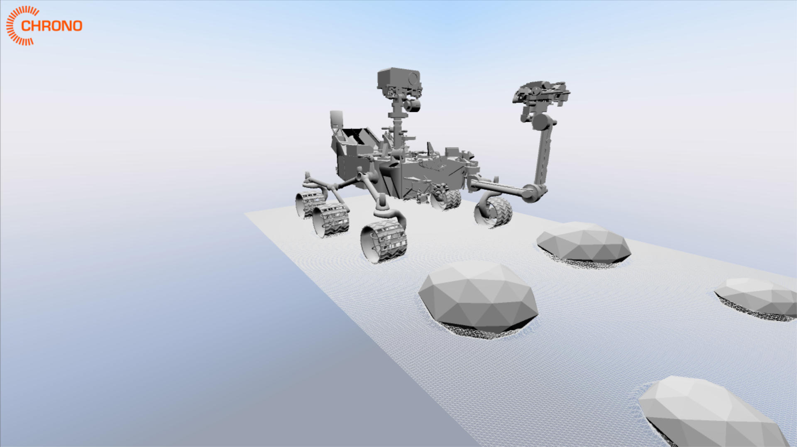
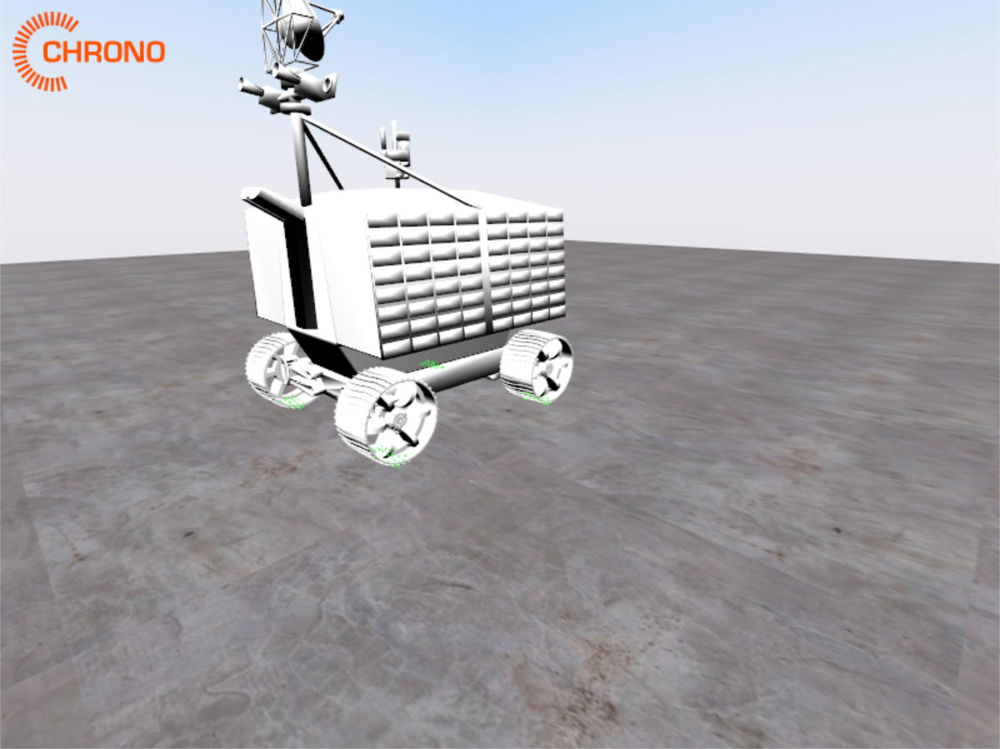
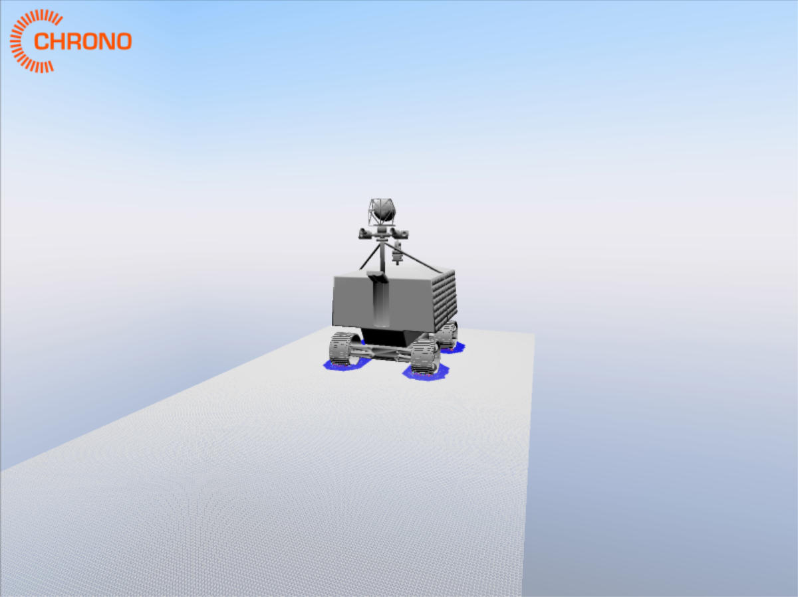
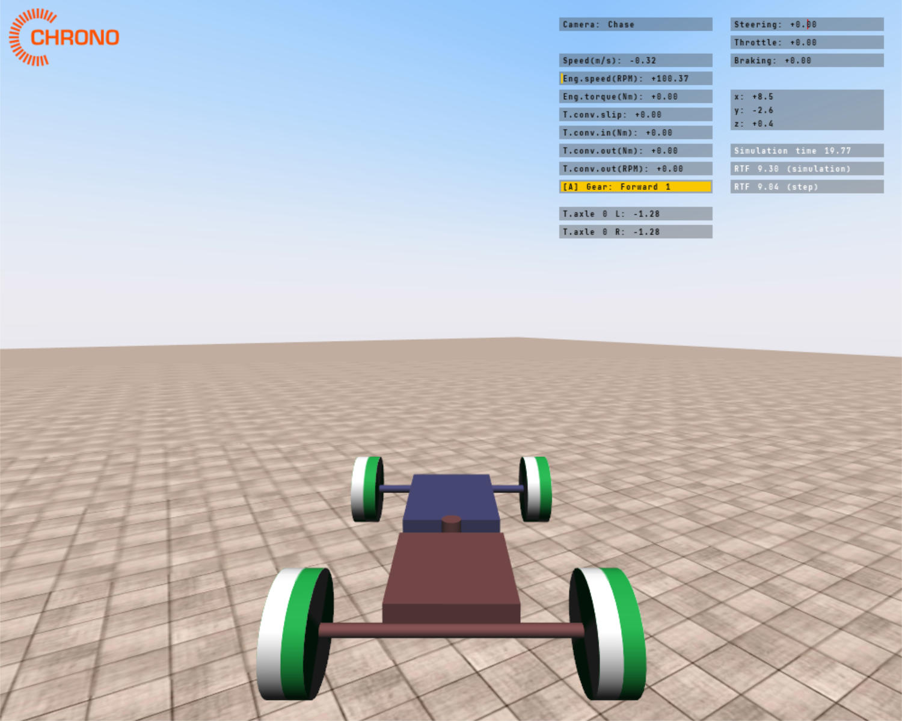
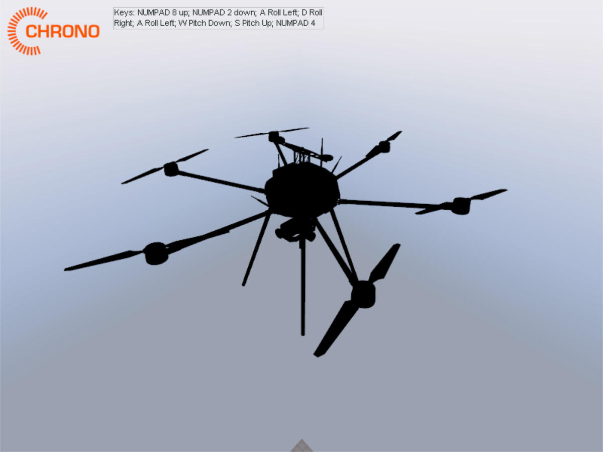
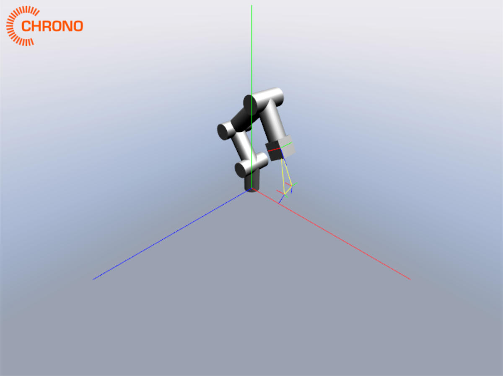

# Chrono 自带示例的列表

* 好奇号行驶在刚体地面 [demo_ROBOT_Curiosity_Rigid](https://github.com/OpenHUTB/chrono/blob/hutb/src/demos/robot/demo_ROBOT_Curiosity_Rigid.cpp)

* 好奇号的土壤接触模型(Soil Contact Model, SCM) [demo_ROBOT_Curiosity_SCM](https://github.com/OpenHUTB/chrono/blob/hutb/src/demos/robot/demo_ROBOT_Curiosity_SCM.cpp)

* 探测车行驶在刚体地面 [demo_ROBOT_Viper_Rigid](https://github.com/OpenHUTB/chrono/blob/hutb/src/demos/robot/demo_ROBOT_Viper_Rigid.cpp)

* 探测车行驶的土壤接触模型 [demo_ROBOT_Viper_SCM](https://github.com/OpenHUTB/chrono/blob/hutb/src/demos/robot/demo_ROBOT_Viper_SCM.cpp)

* 铰链车(VEHicle) [demo_VEH_ArticulatedVehicle](https://github.com/OpenHUTB/chrono/blob/hutb/src/demos/vehicle/articulated_vehicle/demo_VEH_ArticulatedVehicle.cpp)

* 小型六旋翼无人机 [demo_ROBOT_LittleHexy](https://github.com/OpenHUTB/chrono/blob/hutb/src/demos/robot/demo_ROBOT_LittleHexy.cpp)

* 工业机械臂 [demo_ROBOT_Industiral](https://github.com/OpenHUTB/chrono/blob/hutb/src/demos/robot/industrial/demo_ROBOT_Industrial.cpp)

